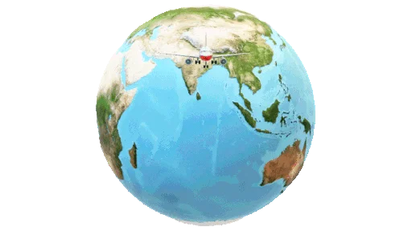

# cadavre-exquis
Uma pessoa estava em Quixadá na praça do Leão então ...
de repente encontrei 5.000 reais a toa, tava lá jogado.

Ela se deparou com a Lady Gaga cantando Abracadabra na praça do leão e sua equipe distribuindo pizzas de Marguerita para os fãs!!! 🤣🤣🤣

Quando um grande acidente ocorreu, acertando sua perna ...
de repente encontrou 5.000 reais a toa, tava lá jogado.
com esses 5.000 reais, ela poderia finalmente comprar a moto que tanto sonhava ...
e com a moto então poderia realizar seu maior desejo...

viajar por Quixadá!!

Explorar as belezas de quixada, indo ao Cedro.
começou a chover muito forte, então fui atrás de um lugar para me abrigar...
A chuva era assustadora, pois lembrei que a infraestrutura do centro era preocupante e poderia acabar me afogando.

começou a chover muito forte, então fui atrás de um lugar para me abrigar..

Além de comer um peixe com baião cremoso e uma coca gelada...
A pessoa que estava na praça do Leão, que definitivamente não sou eu, Narrador personagem, também buscou fugir da chuva e foi a meu encontro...
Decidi pagar um baião cremosa com uma coca para esse indivíduo também...
E ter flashbacks horriveis sobre aulas da ufc
quando passou a grande tempestade, já alimentado, decidiu então partir para a pedra da Galinha...

Quando fui pegar, minha gata me acordou... era um sonho.

A galinha é um ambiente, muito bacana e legal, mas o indivíduo da praça do Leão continua a me seguir.
O que fazer? Estaria em busca de meus míseros R$5.000,00??? Isso é causa de grande consternação, estaria minha vida em perigo?
Tal nervosismo se assentuava por estar seguindo para um local relativamente isolado, se meu Algoz me seguisse, tal situação seria trágica... 

A pessoa que estava na praça, que definitivamente não sou eu, Narrador personagem do Leão também buscou fugir da chuva e foi a meu encontro...
Decidi pagar um baião cremosa com uma coca para esse indivíduo também...
Começou a chover ...    

A pessoa que estava na praça, que definitivamente não sou eu, Narrador personagem do Leão também buscou fugir da chuva e foi a meu encontro...
Decidi pagar um baião cremosa com uma coca para esse indivíduo também...

Decidi pagar um baião cremosa com uma coca para esse indivíduo também...    
Passada a chuva, decido continuar no centro da cidade ...
Decido observar o leão depois de um local decidir contar a história do leão...
Como de repente ficou um tempo quente, vou comprar um sorvete...
Decidiu conhecer mais sobre a cidade, indo a outros pontos turisticos, como o Cedro...  